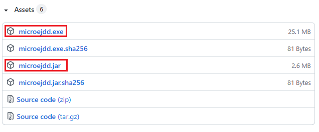
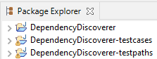
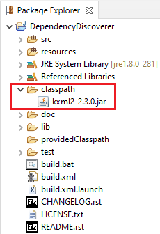

# Overview

MicroEJ Dependency Discoverer is a tool that lists unresolved
dependencies (types, methods and fields) of a set of Java ARchive (JAR)
files and `.class` files.

By default, the tool is configured to download the latest [MicroEJ
Central Repository](https://developer.microej.com/central-repository/)
and then lists only the missing dependencies.

# Requirements

This tool comes with a prebuilt executable file for Windows Operating
System (tested on Windows 10).

You can also run it with the prebuilt JAR file on any Operating System
with a Java Runtime Environment 8 installed.

Finally, you can also import sources from MicroEJ SDK `5.4.1` or higher
(or Eclipse `4.16 (2020-06)` or higher).

# Dependencies

This tool comes with all its external dependencies in `lib` directory.

# Usage

The tool is run by default from command line.

It can also be launched from MicroEJ SDK, by importing and compiling the
repository sources. This case is useful for advanced users that want to
customize the tool. Please refer to the section _Source_ further.

## Download the Tool

- Go to <https://github.com/MicroEJ/Tool-ApiDependencyDiscoverer/releases>
- Download the file according to your Operating System:

  - `microejdd.exe` for Windows OS only.
  - `microejdd.jar` for any OS with a JRE installed.



## Get Started

In this section, we will analyze the dependencies of a popular embedded
Java library (kXML2) against the APIs provided by the libraries
published to the MicroEJ Central Repository.

- Open a terminal in the directory where the executable has been
    downloaded,
- Create a new directory named `classpath`,
- Download the library
    <https://repo1.maven.org/maven2/net/sf/kxml/kxml2/2.3.0/kxml2-2.3.0.jar>
    to the `classpath`,
- Run the tool depending on your Operating System:
  - On Windows OS:
    
    `.\microejdd.exe`
    
   - On any OS with JRE installed:

     `java -jar microejdd.jar`

The tool starts by downloading MicroEJ Central Repository libraries to a
cache location, then performs the analysis of the libraries available in
the `classpath` directory (`kxml2-2.3.0.jar`).

A file named `result.txt` is generated with the list of all unresolved
dependencies. This file is empty (no unresolved dependencies). This
means that kXML2 library is compatible with MicroEJ.

Now, run again with no repository:

    .\microejdd.exe --repository-url=none

The file named `result.txt` is overwritten and contains the list of all
unresolved dependencies required by this library.

## Interpreting the Results

Open the file named `result.txt` with a text editor. Each line contains an
unresolved dependency:

- A **class** described as `package.of.class.Class`.
- An **inner class** described as
    `package.of.class.Class$InnerClassName` (InnerClassName is a number
    if it is an anonymous class).
- A **field** described as `package.of.class.Class.fieldName`.
- A **constructor** described as
    `package.of.class.Class.<init>({parameters types see under})V`.
- A **method** described as
    `package.of.class.Class.methodName({parameters types see under}){return type}`.

Types are represented with the classfile format notation:

- **B**: byte
- **C**: char
- **D**: double
- **F**: float
- **I**: int
- **J**: long
- **L{ClassName};**: reference to a {ClassName} instance
- **S**: short
- **V**: void
- **Z**: boolean
- **\[{type}**: array of {type} (type may be an array itself)

## Options

By default the tool is initialized with the following project structure
in the directory it is executed:

    |
    +--classpath/
    |  |
    |  |--your JAR files to analyze.
    |
    +--providedClasspath/
    |  |
    |  |--your manual JAR files dependencies.
    |
    +--result.txt (the output list of unresolved dependencies)

You can either keep this project structure and modify the base directory
(`--project-dir`), or specify the path to each directory with individual
options.

Here is the list of all available options (output of `microejdd -h`):

Usage:

    microejdd [-hvV] [--clean-cache] [-c=<classpathDir>]
                   [--cache-dir=<cacheDir>] [-D=<projectDir>]
                   [-p=<providedClasspathDir>] [-r=<resultFile>] [-t=<type>]
                   [-u=<repositoryUrl> | -d=<repositoryDir> | -f=<repositoryFile>]

Options:

```
  -c, --classpath-dir=<classpathDir>
                      Directory containing the JAR files and .class files to
                        analyze (defaults to `[PROJECT_PATH]/classpath/`).
      --cache-dir=<cacheDir>
                      Cache directory (defaults to `~/.microej/caches/dd`).
      --clean-cache   Delete Dependency Discoverer cached files (defaults to
                        false)
  -d, --repository-dir=<repositoryDir>
                      Module repository directory to add to provided classpath.
  -D, --project-dir=<projectDir>
                      Project base directory (defaults to current directory).
  -f, --repository-file=<repositoryFile>
                      Module repository ZIP file to add to provided classpath.
  -h, --help          Show this help message and exit.
  -p, --provided-classpath-dir=<providedClasspathDir>
                      Directory containing the provided JAR files (defaults to `
                        [PROJECT_PATH]/providedClasspath/`.
  -r, --result-file=<resultFile>
                      Path to the result file (defaults to `[PROJECT_PATH]
                        /result.txt`).
  -t, --output-format=<type>
                      Listing output format: `json`,`text`,`xml` (defaults to
                        `text`).
  -u, --repository-url=<repositoryUrl>
                      Module repository URL to add to provided classpath or
                        `none` to run with no provided repository (defaults to
                        `https://repository.microej.com/microej-5_0-latest.
                        zip`).
  -v, --verbose       Activate verbose information.
  -V, --version       Print version information and exit.
```

# Source

This section describes how to import and launch the tool from repository
sources in MicroEJ SDK.

## Download Source Code

Clone this repository to a local directory.

## Import Eclipse Projects

- Start MicroEJ SDK in an empty workspace,
- Select `File` > `Import` > `General` >
    `Existing Projects into Workspace`,
- Click on `Select root directory` and browse the clone repository
    directory,
- Check `Search for nested projects` option,
- Click on `Finish` button.

Projects should have been imported and compiled without errors.



## Add JAR Files to Analyze

By default, drop your JAR files into the `classpath` folder.



## Launch the Tool

- Right click on `DependencyDiscoverer` project,
- Select `Run As` > `Java Application`,
- Double click on
    `DependencyDiscovererCLI - com.microej.tool.dependencydiscoverer`
    main class.

The execution starts and traces are redirected to the `Console` view.

## Set Command Line Options

Command line options can be set in the launch configuration.

By default, MicroEJ SDK hides `Java Application` launches in favor of
`MicroEJ Application` launches. This can disabled as follows:

- Select `Window` > `Preferences` > `Run/Debug` >
    `Launching` > `Launch Configurations`,
- Uncheck `Filter checked launch configuration types`,
- Click on `Apply and Close` button.

Now, set command line options as follows:

- Select `Run` > `Run Configurations...` >
    `Java Application` > `DependencyDiscovererCLI`,
- Click on `Arguments` tab,
- Add command line options to the `Program Arguments` text field.

# Restrictions

None.

----
Copyright 2016-2021 MicroEJ Corp. All rights reserved.  
This library is provided in source code for use, modification and test, subject to license terms.  
Any modification of the source code will break MicroEJ Corp. warranties on the whole library.  
